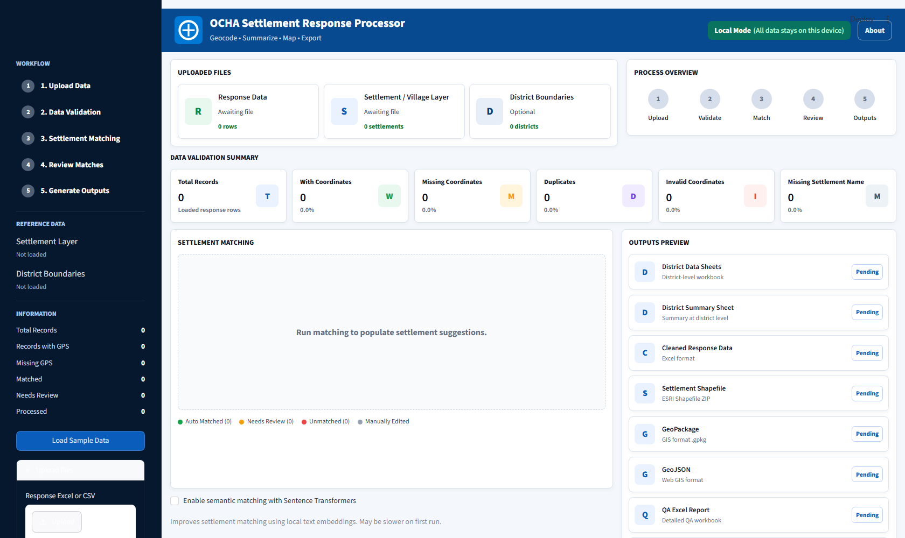
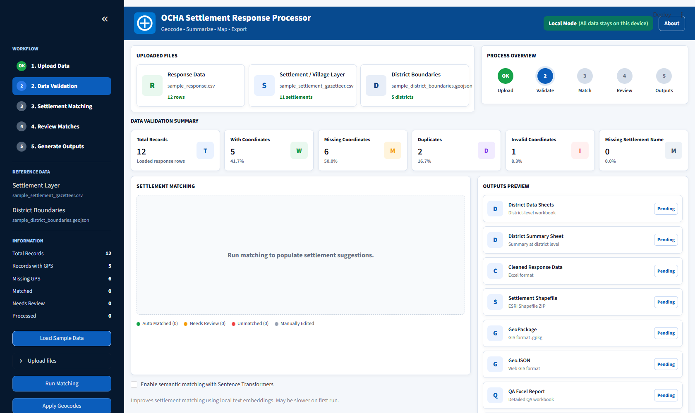
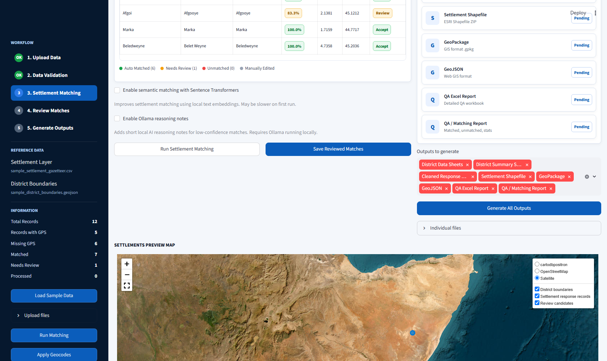
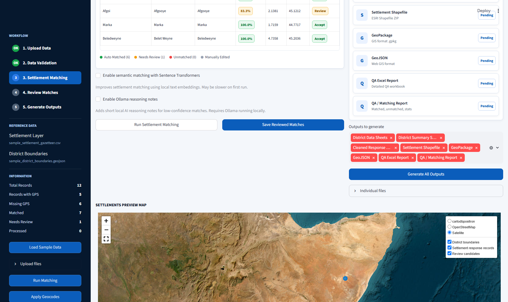
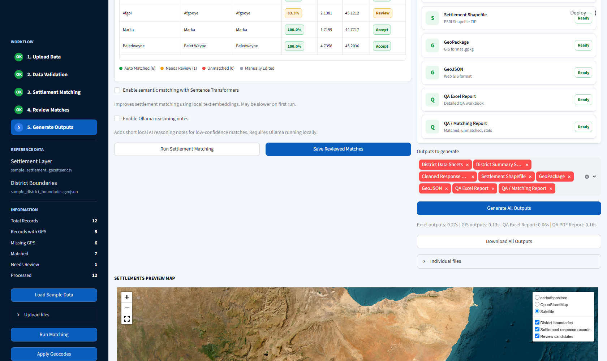

# OCHA Settlement Response Processor — User Guide

**For IM Officers, GIS Specialists, and Data Assistants**

This guide explains how to use the app from a data-operator's point of view: what to prepare, what each screen shows, what the numbers and colors mean, and what to do when a record doesn't match automatically. It assumes no coding knowledge.

---

## 1. What this tool does

The processor takes a partner's response spreadsheet (settlements visited, beneficiaries reached, etc.), matches any records that are missing GPS coordinates against a settlement gazetteer, validates the data for common quality problems, and produces cleaned Excel workbooks, GIS files (Shapefile, GeoPackage, GeoJSON), and QA reports — ready to hand off or load into ArcGIS/QGIS/Power BI.

Everything runs **locally on the workstation**. No response data, gazetteer, or coordinates are sent to any external server. The header always shows a **Local Mode** badge as a reminder of this.

---

## 2. Before you start: what you need

| Input | Required? | Must contain | Notes |
|---|---|---|---|
| **Response data** | Required | Settlement name, District | Latitude/longitude are optional — missing coordinates are what the matching step fills in. Accepts `.csv`, `.xlsx`, `.xls`. |
| **Settlement gazetteer** | Required | Settlement name, District, Latitude, Longitude | Region is recommended, improves match accuracy. Accepts `.csv`, `.xlsx`, `.xls`, or a spatial file (`.geojson`, `.gpkg`, `.zip` shapefile) — point locations are read from the geometry. |
| **District boundary layer** | Optional | — | Adds a boundary overlay to the map. Accepts `.geojson`, `.json`, `.gpkg`, `.zip`. |

You don't have to name your columns exactly. The app recognizes common humanitarian naming variants automatically, for example:

- **Settlement** → `settlement`, `village`, `site`, `location`, `town`, `settlement_name`, …
- **District** → `district`, `admin2`, `adm2_en`, …
- **Region** → `region`, `admin1`, `adm1_en`, …
- **Latitude / Longitude** → `lat`/`lon`, `y`/`x`, `gps_latitude`/`gps_longitude`, …
- Optional columns like **partner**, **cluster/sector**, and **beneficiaries reached** are also detected and carried through into the outputs and summary sheets when present.

If a required column can't be found, the Data Validation step (Step 2) will say so explicitly and name the missing field.

**Don't have your own files yet?** Click **Load Sample Data** in the sidebar to load a ready-made example (12 response rows, 11 gazetteer settlements, 5 districts) and try the whole workflow end-to-end before using real data.

---

## 3. The five-step workflow

The left sidebar tracks your progress through five stages. A stage turns green (**OK**) once it's complete, and the current stage is highlighted:

1. **Upload Data** — load the response file, gazetteer, and optional boundaries.
2. **Data Validation** — review data-quality indicators before matching.
3. **Settlement Matching** — auto-match records that are missing coordinates.
4. **Review Matches** — check anything the matcher wasn't confident about.
5. **Generate Outputs** — produce and download the cleaned files and reports.

The same five steps are echoed as a horizontal **Process Overview** tracker at the top of the main panel.

---

## 4. Step 1 — Upload Data

In the sidebar:

- **Load Sample Data** — instantly loads the bundled example dataset.
- **Upload files** (expandable) — three file pickers: *Response Excel or CSV*, *Settlement Gazetteer*, *District Boundary Layer* (optional). Choose your files, then click **Load Uploaded Files**.

Once loaded, the **Uploaded Files** panel at the top confirms what was read: file name, row count for the response data, settlement count for the gazetteer, and district count for the boundary layer.

If you need to start over completely, use **Restart Process** in the sidebar — it clears all loaded data, matches, and generated files.

---

## 5. Step 2 — Data Validation

Before matching runs, the **Data Validation Summary** gives you six at-a-glance metrics:

| Metric | What it means |
|---|---|
| **Total Records** | Rows read from the response file. |
| **With Coordinates** | Rows that already have valid latitude/longitude — these are left untouched by matching. |
| **Missing Coordinates** | Rows with no GPS value — these are the ones sent to settlement matching. |
| **Duplicates** | Rows that look like repeats (same settlement, district, partner, and cluster). Worth a manual check before reporting. |
| **Invalid Coordinates** | Rows with a latitude/longitude outside valid ranges (lat must be −90 to 90, lon −180 to 180) — likely a swapped or mistyped value. |
| **Missing Settlement Name** | Rows with no settlement name at all — these can't be matched automatically and need to be fixed at the source. |

Behind the scenes the app also checks for districts that don't exist in your gazetteer, and region/district combinations that don't match the gazetteer's hierarchy — both are flagged as issues if found, along with a red/yellow severity so you know what's blocking (red) versus worth reviewing (yellow).

**Practical tip:** if "Missing Settlement Name" or "Invalid Coordinates" is non-zero, fix those in the source spreadsheet and re-upload — no automated step can recover a record with no name or an impossible coordinate.

---

## 6. Step 3 — Settlement Matching

Click **Run Settlement Matching** (in the sidebar, or the button of the same name above the matching table) to attempt to geocode every response row that's missing coordinates.

### How matching works, in order

1. **Exact match** — normalized settlement name matches the gazetteer exactly.
2. **RapidFuzz fuzzy match** *(always on)* — scores the closest gazetteer candidates by text similarity, narrowed first by district/region when available.
3. **Semantic matching** *(optional toggle)* — uses a local Sentence Transformers embedding model (`all-MiniLM-L6-v2`) to catch names that are worded differently but mean the same place. Adds a moment of processing time the first time it runs (it downloads the model once).
4. **Ollama reasoning notes** *(optional toggle)* — for any match that lands in "needs review," asks a local Ollama LLM (`qwen2.5`) for a one-line, plain-English reason. Requires Ollama installed and running on the same machine (`ollama serve`) — if it isn't reachable, the app shows a warning and simply skips this step rather than failing.

Both AI toggles are **off by default** and layer on top of RapidFuzz — they never replace it. If a toggle is on but its dependency isn't installed or reachable, the app warns you and continues with RapidFuzz-only matching so a run never fails outright.

### Confidence scoring and status

Every candidate match gets a confidence score (0–100%), weighted as:

| Component | Weight |
|---|---|
| Settlement name similarity | 50% |
| District similarity | 25% |
| Region similarity | 15% |
| Administrative consistency (do district/region actually pair up in the gazetteer?) | 10% |

| Confidence | Status | What happens |
|---|---|---|
| **90–100%** | 🟢 Auto Matched | Coordinates are applied automatically. |
| **75–89%** | 🟠 Needs Review | Flagged for manual follow-up — see Step 4 below. |
| **Below 75%** | 🔴 Unmatched | No confident candidate was found. |

The matching table shows submitted settlement/district, the suggested match, confidence, latitude/longitude, and a color-coded pill. The legend below the table (Auto Matched / Needs Review / Unmatched / Manually Edited) always shows current counts.

---

## 7. Step 4 — Review Matches

"Needs Review" and "Unmatched" records are the ones worth your attention — the app deliberately does **not** auto-apply anything below 90% confidence, so a human always has the final say on lower-confidence geocodes.

This build of the app doesn't yet include an in-app grid for accepting or overriding individual low-confidence matches row-by-row. In practice, resolve them one of these ways:

- **Fix the spelling at the source.** Most "needs review" cases are a spelling or transliteration difference (e.g. "Deynile" vs. "Deeyniile"). Correct the settlement/district name in the response file and re-run matching.
- **Turn on semantic matching** if you haven't — it often resolves near-miss spellings that RapidFuzz alone scores lower.
- **Check the QA Excel Report's "Low Confidence" sheet** (generated in Step 5) — it lists every needs-review/unmatched record with its suggested candidate side by side, useful for a bulk manual review pass or handing off to someone with local knowledge.
- **Source the coordinate manually** (e.g. from the gazetteer, a partner, or a map) and enter it directly into the response file, then re-upload — this is the most reliable fix for genuinely unmatched settlements that aren't in the gazetteer at all.

Once you're satisfied with the matches, click **Save Reviewed Matches** and then **Apply Geocodes** (sidebar) to write the accepted coordinates back into the working dataset used for outputs and the map.

---

## 8. The Settlements Preview Map

Below the matching and outputs panels, the **Settlements Preview Map** gives you a full-width, interactive view of every geocoded record:

- **Base layers** — switch between CartoDB Positron (light reference), OpenStreetMap, and Esri Satellite imagery using the layer control (top right).
- **Overlays** — toggle district boundaries, settlement response records (clustered markers, colored by match status), and review candidates (matches still needing attention) on or off independently.
- **Click any marker** for a popup with settlement name, district, match status, and confidence.
- **Zoom controls** (top left) and normal scroll-wheel/drag zoom and pan, like any GIS viewer.
- **Fullscreen button** (top left, expand icon) — opens the map to fill the browser window, useful when working with a large or dense dataset.
- **Mini-map** (bottom left) — shows your current viewport in the context of the wider region.

The map updates automatically as you load data, run matching, and apply geocodes — no manual refresh needed.

---

## 9. Step 5 — Generate Outputs

Use the **Outputs to generate** multiselect to choose which files you need (all are selected by default), then click **Generate All Outputs** (or **Generate Selected Outputs** if you've narrowed the list).

| Output | Format | Contents |
|---|---|---|
| **District Data Sheets** | Excel workbook | One sheet per district with response records. |
| **District Summary Sheet** | Excel | Aggregated totals by district (and cluster, where available). |
| **Cleaned Response Data** | Excel | The full response dataset with applied geocodes and match metadata columns. |
| **Settlement Shapefile** | ESRI Shapefile (zipped) | Point layer for GIS software. |
| **GeoPackage** | `.gpkg` | Same data, modern GIS format. |
| **GeoJSON** | `.geojson` | Web-GIS-friendly point layer. |
| **QA Excel Report** | Excel | Readiness metrics, validation issues, full match table, a dedicated "Low Confidence" sheet, and district/cluster summaries. |
| **QA / Matching Report** | PDF | A shareable summary of matching results and data quality, suitable for a partner or coordination meeting. |

A processing log (`ocha_processing_log.txt`) and a combined **Download All Outputs** ZIP are generated automatically alongside your selected files. Individual files remain available for one-off download under **Individual files**. Each output card shows **Ready** once generated, or an error message if a stage failed (for example, if GeoPandas isn't installed for the GIS exports).

---

## 10. Reading the sidebar at a glance

The sidebar's **Information** panel is a live dashboard of where you stand:

- **Total Records** — rows in the response file.
- **Records with GPS** — already had valid coordinates on upload.
- **Missing GPS** — still need matching.
- **Matched** — auto-matched + needs-review records combined.
- **Needs Review** — subset of Matched that isn't yet at auto-accept confidence.
- **Processed** — rows in the final processed dataset (used for outputs/map) after geocodes are applied.

The **Reference Data** section above it reminds you which gazetteer and boundary files are currently loaded.

---

## 11. Troubleshooting / FAQ

**"sentence-transformers is not installed" warning.**
Semantic matching was turned on but the package isn't available in this environment. The run still completes using RapidFuzz only. Ask whoever manages the installation to run `pip install sentence-transformers`, then try again.

**"Ollama is not reachable at localhost:11434" warning.**
Ollama reasoning notes were turned on, but no local Ollama server is running. The run still completes without the extra reasoning notes. To enable it: install [Ollama](https://ollama.com), run `ollama pull qwen2.5`, then `ollama serve`, and re-run matching.

**A settlement I know exists isn't matching at all.**
Check it's actually present in the gazetteer (correct spelling, correct district). If it's genuinely missing from the gazetteer, no amount of fuzzy or semantic matching will find it — it needs to be added to the gazetteer file, or the coordinate entered manually.

**The map shows fewer points than my total record count.**
The map only plots rows that currently have a valid coordinate. Rows still "Needs Review" or "Unmatched" won't appear until they're resolved (Step 4) and geocodes are applied.

**I want to start over with a different dataset.**
Click **Restart Process** in the sidebar. This clears loaded files, matches, and any generated outputs, without needing to reload the app.

**Is any of my data leaving this computer?**
No. The app has no cloud dependency for its core matching (RapidFuzz and Sentence Transformers both run locally), and Ollama, if used, is also a local process. The header's **Local Mode** badge is a permanent reminder of this.

---

## 12. Quick reference

**Confidence thresholds**

| Range | Status |
|---|---|
| 90–100% | Auto Matched |
| 75–89% | Needs Review |
| 0–74% | Unmatched |

**Status colors used throughout the app (table pills and map markers)**

| Color | Status |
|---|---|
| 🟢 Green | Auto-accepted / already geocoded on upload |
| 🟠 Amber | Needs review |
| 🔴 Red | Unresolved / invalid |
| ⚪ Grey | Manually edited / rejected |

**Required columns**

| Dataset | Required fields |
|---|---|
| Response data | Settlement, District |
| Gazetteer | Settlement, District, Latitude, Longitude |
